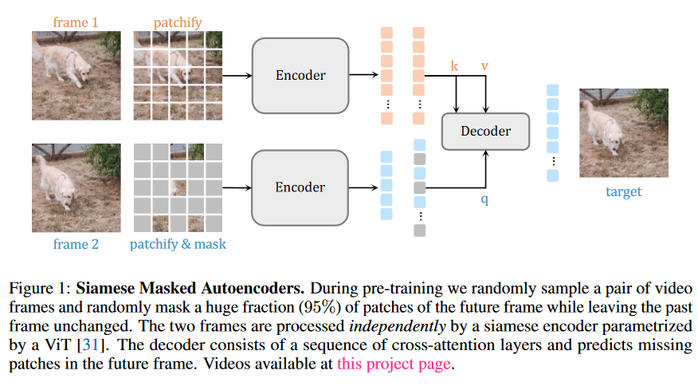

## Abstract

一句话概括本文的贡献，作者将MAE方法由图像端扩展到视频端，并命名为SiamMAE。

预测的方法简单来说，保持过去的视频帧数保持不变，masked掉未来的95%的帧数，进行表征学习。

最终结果作者表示具有优异的表现，同时可以对图像边缘进行检测。

## Introduction

视觉学习不能忽略时间，时间维度下，人类可以在遮挡，视觉点变化，对象移动变换，等阻碍下进行学习，这对无监督学习非常关键。

目前一个比较强大的自监督学习方法（范式）是预测学习，类似于MAE。

作者这里高度概括了对比学习与预测学习。

~~~
预测学习很强大，但是落后于对比自监督。
对比学习直观上适用于各种任务，因为可以对比方法可以有着多种数据增强。
但是，对比学习依赖于细节选择，以及附加内容，总之就是需要各种条件才能进行学习，否则会崩溃。
~~~

随后，作者讲了一下MAE的优劣：

~~~
MAE将MVM方法从NLP引入到CV，有着很好的效果，但是优缺点如下:
1. 本职工作是像素重建，finetune之后有着优秀的性能，但是zeroshot效果不佳。
2. 视频方向，已经有拓展可以用于视频方向，内容如下：掩盖所有帧的大部分补丁。这导致其工作效果不佳，
~~~

作者认为，时间维度是图像中一个特殊的维度，因为时间维度上，过去与未来不是对称的，而现有的MAE是对称的处理过去帧与未来帧相同比例的mask。实验验证，对称帧率的mask训练效果并不比图像训练好。

综上，作者提出SiamMAE，通过过去未来帧数的不对称训练，来实现视频更好的训练MAE，获得高于图像训练的效果。

SiamMAE的结构图：

如果看过CrossViT，就会发现这个结构与交叉ViT完全一致，只是将不同维度的batch换成了mask与unmasked进行cross。